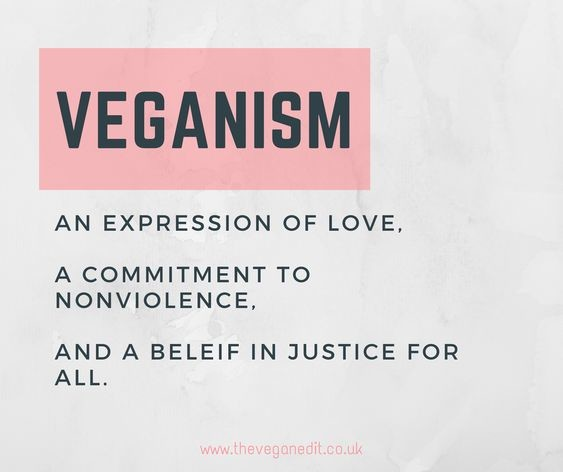
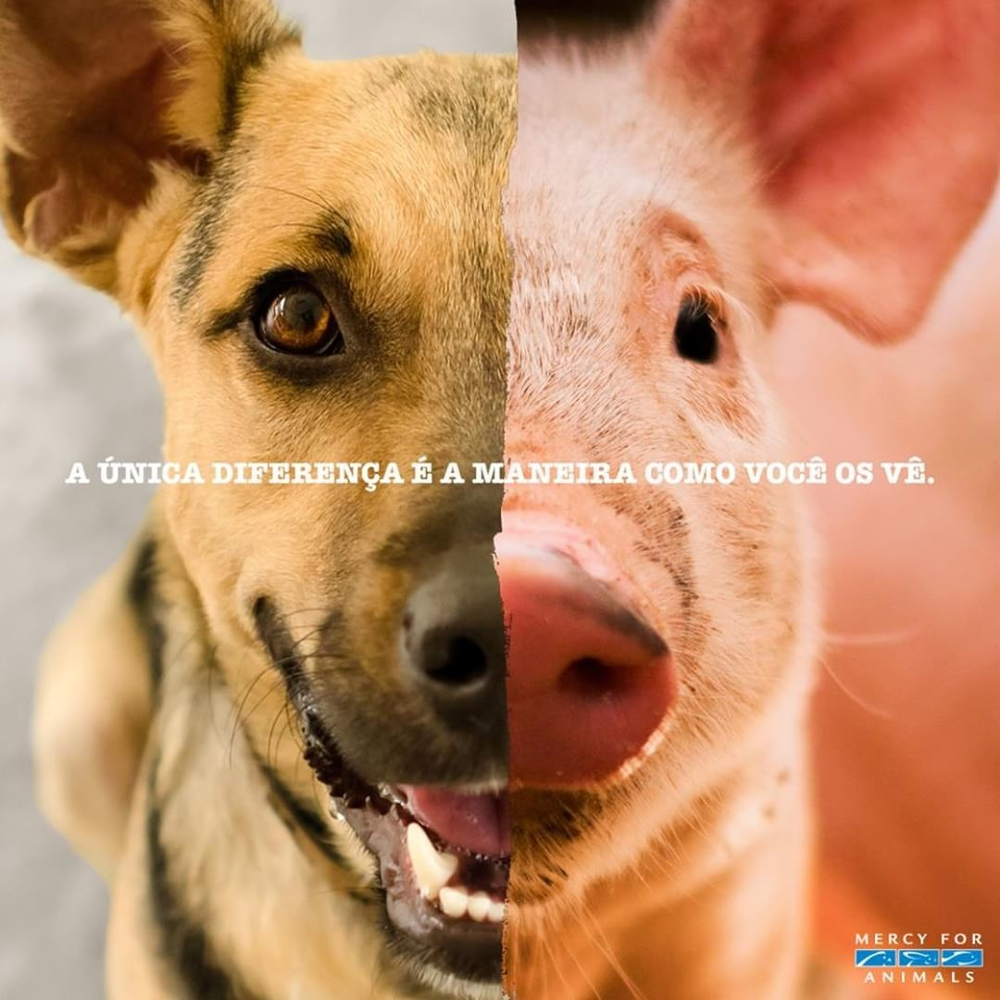
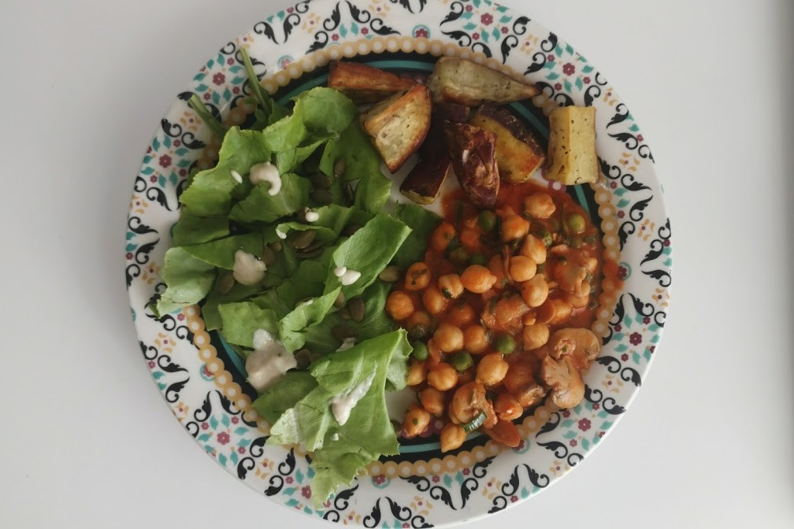
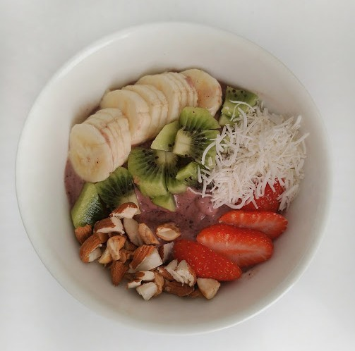
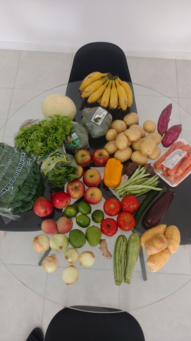
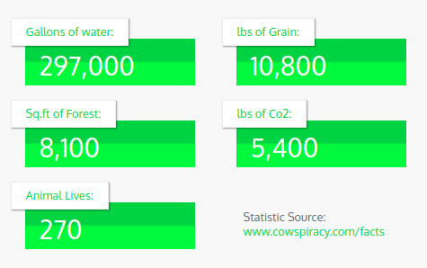
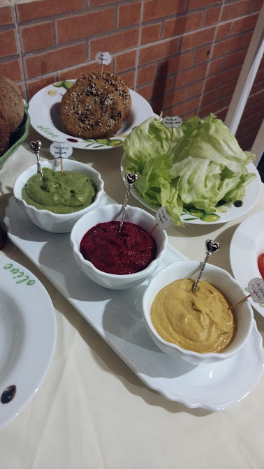
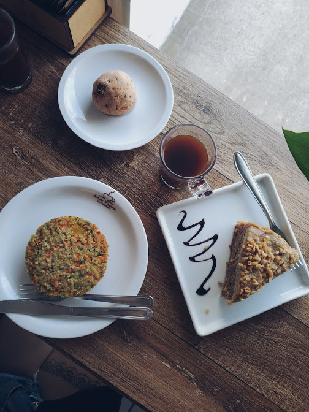
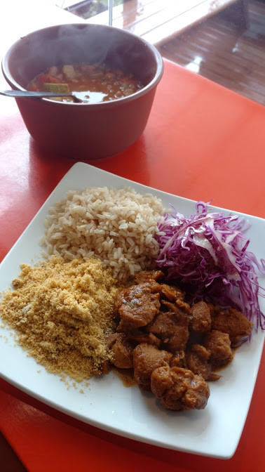
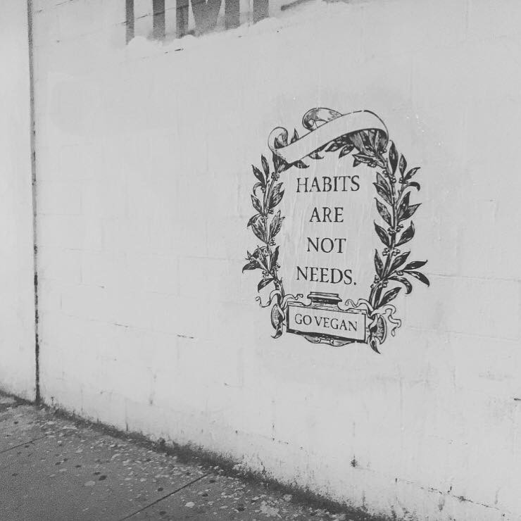

Existem muitos estereótipos que vêm à mente quando escutamos a palavra "vegano". Você talvez tenha imaginado que isso significa comer apenas alface e cenouras ou quem sabe pensou em hippies abraçando árvores. Mas para resumir, vegano é alguém que tenta excluir ao máximo o consumo de produtos de origem animal em todas as áreas da sua vida. Isso inclui alimentação, vestuário ou qualquer outro tipo de atividade que possa envolver sofrimento de animais.

> O veganismo não é apenas uma dieta, é uma mudança de estilo de vida

Nunca pensei que iria me tornar essa pessoa e nem planejei isso, mas há nove meses eu (e meu marido) decidimos mudar nossas vidas depois de assistir a um documentário.

Faz algum tempo que eu comecei a me tornar mais consciente sobre minha alimentação e passei a me preocupar em como os alimentos podem influenciar na minha saúde, física e mental. Nessa jornada eu acabei testando vários tipos de dietas e até mesmo algumas receitas *"mágicas"*, como aquele famoso café com manteiga. Experimentei a *Low Carb*, que propõe reduzir a ingestão de carboidratos, como o próprio nome sugere, e também a dieta Cetogênica que tem uma ingestão mínima de carboidratos e é rica em gorduras. Eu até me sentia bem — pelo menos melhor do que quando não me preocupava com a alimentação — mas ainda não tinha certeza do impacto que essas dietas teriam na minha saúde.

Então em uma das minhas pesquisas encontrei o documentário "<a href="https://www.netflix.com/br/title/80174177" target="_blank" rel="nofollow noopener">What the Health</a>". Muitas pessoas nas redes sociais estavam relatando que pararam de comer carne depois de assisti-lo, e foi isso que aconteceu comigo também. Depois de assistir eu sabia que precisava mudar algo e assim me tornei ***vegana***.

Frequentemente as pessoas me dizem que eu fiz uma mudança radical. E até foi, não pela dificuldade, mas porque mudou a minha vida completamente. De um dia para o outro eliminei da minha alimentação tudo aquilo que contribuísse de alguma forma para o sofrimento animal.

*Se eu tivesse que resumir minha transição para o veganismo seria assim.*

Então, como muitas pessoas tem curiosidade e me perguntam como é ser vegano, decidi falar neste texto sobre algumas coisas que mudam quando você adota este estilo de vida. Não estou tentando persuadi-lo a fazer a mudança, quero apenas mostrar ***o que aconteceu comigo quando me tornei vegana***.

# Você vai conversar muito sobre o assunto

Quando você se torna vegano precisa estar preparado para responder uma série de perguntas sempre que vai comer com pessoas que não estão familiarizadas com esse estilo de vida. A principal delas é "*por quê?*". No meu caso a resposta é **compaixão**, **saúde** e **sustentabilidade** — nessa ordem.

**Compaixão** porque não acho justo que um ser senciente, capaz de sentir sensações e sentimentos de forma consciente, assim como nós humanos, precise morrer para satisfazer um simples desejo do meu paladar — *e a propósito, sim é possível mudar o seu paladar*. Fazer esta escolha significa não acreditar que uma vida seja mais importante do que a outra, independente da espécie.

**Saúde** porque a qualidade do alimento que comemos afeta diretamente nosso corpo e mente. O consumo de alimentos vegetais e integrais oferece mais nutrientes, antioxidantes e fibras, o que traz muitos benefícios para a saúde. Pesquisas mostram que pessoas que se alimentam estritamente de vegetais têm menos risco de ter doenças crônicas e melhor ingestão de nutrientes. Fazer esta escolha é um ato de amor à vida.

**Sustentabilidade** porque a pecuária é extremamente destrutiva para o planeta. É a maior contribuinte para as emissões de gases do efeito de estufa, é uma das principais causas do uso de terra e água, desmatamento, destruição da vida selvagem e extinção das espécies. Fazer esta escolha é um ato de amor ao planeta e todas os seres que vivem nele.

*Veganismo: uma expressão de amor, um compromisso com a não-violência e a crença na justiça para todos*

# Sua mente irá se abrir para novas informações

Quando fiz a transição eu aprendi muito. Fiquei meses estudando sobre esse estilo de vida, li livros, assisti palestras on-lines, assisti Youtubers veganos e muitos documentários. Descobri ao assistir o documentário "<a href="http://www.cowspiracy.com/facts/" target="_blank" rel="nofollow noopener">Cowspiracy</a>", disponível no Netflix, que para produzir um hambúrguer são utilizados 3.000 litros de água e que isso é o equivalente a quase dois meses de banho — isso sem contar a quantidade de remédios, hormônios e alimentos transgênicos que as vacas ingerem e vai para seu corpo quando você as come. A criação de animais para alimentação é responsável por 55% do consumo de água do planeta. Mais de 45% da terra utilizável do mundo é usada para o gado e mais de 91% da destruição da Amazônia é devido à agricultura animal. Há também estudos que sugerem que, se não mudarmos a forma como consumimos peixe, até 2048 eles estarão extintos.

Isso que mencionei apenas fatores ambientais, assistindo "<a href="https://www.youtube.com/watch?v=euvdedl-qso" target="_blank">A carne é fraca</a>" e "<a href="https://www.terraqueos.org/" target="_blank" rel="nofollow noopener">Terráqueos</a>" vi a realidade cruel a que nossa sociedade submete milhões de animais todos os anos, tanto para a exploração ligada à alimentação, quanto o vestuário, pesquisa, entretenimentos e afins. Apenas para o nosso prazer. Estes foram os mais impactantes e costumo dizer que é o *principal motivo que me mantém vegana*. Não quero fazer parte dessa crueldade e não quero pagar para outra pessoa causar dano a esses seres inocentes e conscientes. Ainda fico confusa quando alguém diz amar os animais mas ainda os come.

Assistindo "<a href="https://www.fmtv.com/exclusive/food-matters-21dp/watch?utm_source=fmsite&amp;utm_medium=fmsite&amp;utm_content=rhsbanner" target="_blank" rel="nofollow noopener">Food Matters</a>" e "<a href="https://www.forksoverknives.com/the-film/#gs.TiNoZbchttps://www.pjySPnA" target="_blank" rel="nofollow noopener">Forks Over Knives</a>" aprendi como a alimentação atual (excesso de açúcar, sal, gordura animal, agrotóxicos, transgênicos) está destruindo o ser humano aos poucos, transformando-o em um escravo das indústrias farmacêuticas. Esses documentários mostram como uma dieta baseada em vegetais é a melhor forma de combater doenças cardíacas, obesidade, diabetes e câncer. Poderia escrever páginas e páginas sobre todas as coisas, mas não vou me aprofundar agora.

Junto com todo esse novo conhecimento vem raiva, frustração e confusão. Como todos não conhecem essas informações? Por que eu não sabia? Por que ninguém enxerga? E por que não nos é ensinado isso? Se você é vegano, você conhece esse "drama".

# Você vai descobrir infinitas possibilidades e vários novos sabores

Mudar a alimentação: essa é a melhor parte e a mais fácil, acredite. O meu paladar mudou completamente, comecei a consumir muito mais grãos, frutas e vegetais frescos e passei a me alimentar de novos produtos: leite de vegetais, tofu e diversas combinações — a comida vegana é muito mais saborosa e "feliz" do que coisas "mortas"! Comecei a me aventurar na cozinha, pesquisar, testar novas receitas e acabei aprendendo a cozinhar muito mais coisas e melhor. Mas se você não gosta, hoje existe muitas possibilidades e opções vegans por aí.

*Batata doce assada, salada verde com sementes e molho de tahine, "strogonoff" de grão de bico.*

*Smothie de banana, morango a açaí finalizado com frutas e nuts.*

Os gastos, ao contrário do que as pessoas pensam, não aumentaram. Com o que eu comprava carne, peixe ou frango, por exemplo, agora compro muitas frutas e vegetais (quase sempre orgânicos), cereais integrais, leguminosas, oleaginosas.

*Feira da semana.*

E as proteínas? — Se eu ganhasse um real por cada vez que alguém me fizesse essa pergunta, eu seria milionária! Por algum motivo, imagina-se que a fonte de proteínas é apenas de origem animal, o que não é verdade, os nutrientes vêm do solo. Então, se as vacas comem plantas e as plantas fornecem às vacas todos os nutrientes que elas necessitam, por que devemos supor que a carne seja a única fonte de proteína? As plantas são fontes surpreendentes de proteína e são facilmente absorvidas pelo organismo.

Já em relação a deficiência de ferro e vitaminas do complexo B, basta escolher alimentos certos. Se puder contar com a ajuda de um nutricionista, melhor ainda. A <a href="https://nutrilouyse.wixsite.com/nutrilouyse/sobre" target="_blank" rel="nofollow noopener">Louyse</a> me ajudou muito, dando várias dicas e orientações. A única coisa que talvez você precise suplementar é a vitamina B12, que realmente não é encontrada em nenhum alimento vegetal. Isso porque ela é produzida por bactérias, que são ingeridas pelos animais na água e nos alimentos.

Se você quiser saber mais sobre alimentação, <a href="https://www.instagram.com/kellynvd" target="_blank" rel="nofollow noopener">perfil no Instagram</a> gosto de postar as minhas refeições e lugares com opções veganas.

# Você poderá se tornar mais saudável e terá mais energia

Comer tudo o que seu corpo naturalmente precisa faz você se sentir incrível. Eu me sinto infinitamente melhor comendo refeições ricas em alimentos vegetais, isso porque eu opto por uma alimentação o mais natural possível, como poucos produtos processados e prefiro sempre as comidas mais simples. E também nunca me sinto culpada, porque posso comer o que eu quero e não prejudicar nenhum animal e nem a mim mesma.

Tenho mais disposição, minha saúde melhorou e é raro eu ficar resfriada ou gripada, já que minha imunidade aumentou bastante. Ser vegano me permitiu aprender muito sobre o que nossos corpos precisam e me deu um verdadeiro entendimento sobre saúde. Antes de ser vegana por exemplo, como a maioria das pessoas, eu pensava que precisávamos de leite para obter o cálcio. Porém o cálcio é encontrado em quase todos os alimentos vegetais e, ao consumir uma dieta baseada em plantas, é fácil obter o suficiente e essa fonte é muito melhor do que qualquer uma que provenha de produtos lácteos.

E para quem pratica esportes, não tem o que se preocupar. Muitos <a href="https://awebic.com/saude/atletas-veganos/" target="_blank" rel="nofollow noopener">atletas veganos</a> tem se destacado em várias modalidades. Eu pratico crossfit há mais de um ano e meu melhor desempenho tem sido nestes últimos meses. Também iniciei musculação desde o começo do ano para um projeto junto com a minha irmã, que é formanda em Educação física, e queremos mostrar que é possível substituir proteínas animais por vegetais para quem pratica exercícios de força e ainda assim ter resultados relevantes. Se quiser, pode acompanhar a evolução <a href="https://www.instagram.com/veganmoving" target="_blank" rel="nofollow noopener">por aqui</a>.

Talvez uma das diferenças mais visíveis na minha vida depois de ter virado vegana tenha sido o incrível benefício mental e emocional. Nunca pensei que o que você escolhe para alimentar o seu corpo poderia fazer uma diferença tão grande no estado de espírito e felicidade. Posso dizer sem hesitação que os últimos nove meses da minha vida foram os melhores, até agora. Claro que existem outros fatores que contribuíram para minha felicidade, mas acredito de todo o coração que o mais importante foi veganismo.

# Você começará a refletir sobre outras escolhas na sua vida

O estudo não só me levou a aprender sobre o veganismo, mas também me fez pensar sobre todos os problemas que afetam o nosso planeta. O que está causando mudanças climáticas, as consequências das grandes indústrias, principalmente a agricultura animal, mas também a indústria da moda e alto consumo de produtos descartáveis.

Essa nova busca do combate ao consumismo me apresentou ao minimalismo. Mudei muito em relação a esse ponto, minha alegria não é possuir coisas novas, hoje sou mais feliz removendo coisas da minha vida. Evito fazer compras em lojas de fast fashion e me tornei uma consumidora consciente com comida, moda e beleza. Quero ajudar as pessoas e o planeta com todas as compras e todas as decisões que tomo.

# O veganismo vai te ajudar a focar nas coisas que realmente importam

Avisar as pessoas que você não come mais carne, esse é o pior momento. Seja qual for o argumento: sustentabilidade, maus tratos aos animais, saúde, nenhum deles farão de você uma pessoa respeitável e informada. É difícil ir contra a maioria das pessoas porque ou elas ficam fazendo piadas — sempre as mesmas diga-se de passagem — ou te julgam como chato por argumentar não consumo de derivados de animais. Claro que tem os que acreditam e se interessam pela filosofia toda, mas são poucos.

Isso fez eu me afastar de pessoas que não entendiam a escolha do meu estilo de vida e achavam que era extremo. No começo eu me sentia estranha e que não me "encaixava" mais, devido a opiniões e críticas de outras pessoas, mas agora estou confortável com ser estranha para algumas pessoas porque sou feliz com minha escolha. Parei de me preocupar com o que os outros pensam de mim e qualquer um que tenha algo negativo a dizer não vale a pena ter por perto.

O veganismo me deu algo maior para concentrar minha energia, hoje eu sinto que encontrei meu propósito, que é contribuir para tornar este mundo um lugar melhor, difundir a mensagem vegana, ser um bom exemplo tentando viver uma vida que não prejudique outros seres vivos, o nosso planeta e me tornar a melhor versão de mim. É muito bom saber que cada decisão de uma refeição que faço terá um impacto positivo no planeta e vai salvar alguns animais — ou muitos.

*Um estilo de vida vegano salva animais, o meio ambiente e muito mais. Essa imagem mostra o quanto eu salvei em nove meses.*

# A forma como você se relaciona com as pessoas irá mudar

Além das piadas e críticas, quando você se torna vegano todo mundo, imediatamente, vira nutricionista! As pessoas te dirão o tempo todo que "sua alimentação é muito restrita" e não é, é apenas diferente. Te farão perguntas como "Nossa, e o que você come?", "e as proteínas? e o cálcio? e o ferro?" "ah, por isso que você é tão magra". Não as culpo, pois a maioria delas repete o que ouviu e aprendeu a vida inteira. No começo eu me sentia incomodada, algumas pessoas são muito indiferentes e afirmam que não tem como viver sem carne — *oi? eu estou aqui*. Minha resposta foi estudar e me informar para saber responder muito bem cada pergunta.

Mas eu também tenho sorte de ter amigos e familiares maravilhosos. Mesmo a minha família, amante da carne, aceita o meu novo estilo de vida mais do que eu jamais poderia ter imaginado. Já no primeiro fim de semana, após tomar a decisão de ser vegana, fui no aniversário do meu pai (carnívoro convicto). Como um bom gaúcho, todas as refeições na casa dele giram em torno da carne bovina. Mas me virei super bem, sempre tem o básico disponível, como arroz, legumes e salada. Meu pai foi uma das pessoas mais compreensíveis, não me criticou e sempre que eu vou na casa dele ele se esforça pra fazer uma comida diferente. Outra vez fui na casa de uma amiga para uma "noite de hambúrgueres", e mesmo ela não sendo vegetariana ou vegana, ela teve o cuidado de preparar pão, hambúrguer, molhos e até "queijo" veganos.

*Amiga que prepara comida vegan, Renata ❤️*

Não há palavras para expressar o quanto isso significa para mim. Isso mostra que, não importa quais sejam os pensamentos deles sobre o veganismo, eles se importam o suficiente para procurarem e aprenderem um pouco mais sobre esse tipo de alimentação. Claro, nem sempre é assim, mas basta organização (como antes, depois ou levo marmita) e ao contrário do que normalmente as pessoas pensam, não, eu não passo fome nem vontade! A relação com a comida muda, não é mais um alimento que eu vejo quando a pessoa está ingerindo um animal morto ou derivados. Tudo o que eu consigo enxergar é sofrimento.

Em relação a comer em restaurantes, pode ser um pouco mais difícil, mas isso me forçou a descobrir novos e ótimos lugares. Eu sempre consigo me virar, porque eu saio da minha zona de conforto, e tenho consciência de que isso é mais importante do que o prazer momentâneo.

*Ana Terra Café em Criciúma/SC tem os melhores bolos veganos ❤️*

*Vorixo em Torres/RS, o cardápio é todo vegano e todo dia tem um prato diferente no almoço.*

# E o mais importante, você estará contribuindo para um mundo melhor

O mais difícil de tudo foi perceber que nem todos querem ser veganos. Algumas pessoas são educadas sobre o assunto, sabem o dano que comer carne pode causar, mas apenas querem optar pelo mais "fácil". Mas sei que inspirei algumas pessoas a mudarem alguns dos seus hábitos e isso já valeu muito a pena.

*Hábitos não são necessidades. #govegan*

Escolher não consumir produtos de animais explorados, violentados ou mortos me fez sentir uma pessoa melhor, mais consciente, saudável e feliz. Sinto estar fazendo a minha parte, mesmo que seja um trabalho de formiguinha, pois entendo que cada pessoa pode contribuir para mudar o mundo e ninguém é sem importância quando se trata de algo maior. Todas as mudanças positivas começaram com algumas pessoas dando os primeiros passos e depois muitos outros seguindo esses passos.

Sinta-se também convidado a abraçar essa nova vida e consciência ética, que te fará viver mais e melhor e te moverá para um mundo mais compassivo, humanitário e sustentável.

E se você já é vegano, vegetariano ou está no processo me conta aqui como foi a sua transição ou se você se identificou com algumas dessas mudanças. :)
