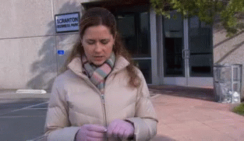

Você ouve o tempo todo que fazer o que você ama ou o que você é apaixonado é o caminho para a felicidade na carreira.

Pessoas ao nosso redor vendem esta ideia de que amar o seu trabalho é de extrema importância na sua vida. Essas pessoas têm boas intenções — elas não querem que você seja forçado a uma vida da qual você não gosta ou uma carreira que não te satisfaz. Mas esse conselho ainda é verdadeiro? Você vai encontrar uma carreira que você é incrivelmente apaixonado, que vai fazer toda a sua vida parecer férias?

# Minha história de carreira

Sabe aquelas pessoas que desde muito novas já sabem o que querem fazer, que profissão seguir? Pois é, eu não fui uma delas. Quando era mais nova eu já quis ser astrônoma, depois oceanógrafa, bióloga, psicóloga — essa última inclusive cheguei a cursar por um período.

Mas se tinha uma coisa que eu tinha certeza que NÃO queria era ser professora. Na minha família tem muitas professoras, incluindo minha mãe, e conhecendo o dia a dia delas achava que dar aulas não era para mim. Mas por circunstâncias da vida acabei cursando adivinha o quê? Pedagogia. Sim, me tornei professora.

Me formei em pedagogia e dei aula por alguns anos — mas eu não amava fazer isso, pelo menos não todo o tempo. Depois de algum tempo lecionar começou a não fazer mais sentido para mim e fui em busca de novos desafios. Fui para uma área totalmente diferente, decidi me arriscar nas exastas — mas não foi de uma hora para outra e não foi simples. Comecei então a trabalhar como analista de suporte numa empresa de software e iniciei um novo curso, Análise e Desenvolvimento de Sistemas.

Assim que eu novamente não me senti mais desafiada, decidi que era hora de mudar de novo. Fui morar em outra cidade e comecei a trabalhar como Analista de projetos numa startup de tecnologia que desenvolve software para a educação — e nesse caso, vejam só, a minha formação em Pedagogia foi super útil.

E do novo, durante esse tempo eu não amava o que eu fazia, mas preciso destacar que hoje me sinto orgulhosa com a maneira como eu estava fazendo o meu trabalho. Eu sempre dei o meu melhor e sem dúvidas foi a época que mais evolui como profissional: tive experiência com operações, comercial, marketing, processos, de tudo um pouco. E por fim, me tornei Gerente de produtos. Agora estou eu aqui, de novo, fazendo uma nova transição de carreira.

Depois de tanta indecisão em relação à minha profissão e depois de caminhar por todas essas diferentes áreas eu acabei percebendo que não é o trabalho em si que me dava a motivação diária e sim o objetivo da conquista. Eu acho que sempre fui movida a desafios, sempre fui muito determinada fazendo tudo o que estava ao meu alcance para chegar onde eu queria.

Constantemente me empolgo com algo, me dedico a um determinado assunto e quando aprendo um pouco perco todo o interesse e fica sempre um vazio, uma sensação de que falta algo. Foi aí que a angústia e ansiedade começaram, pois comecei a pensar se realmente eu estava fazendo a coisa certa. Quem me garante que quando eu for para uma outra área a mesma coisa não vai acontecer? Ou será que eu vou me arrepender? Ou quem sabe na verdade eu gostava sim do que eu fazia, às vezes sim, às vezes não. Será que é normal?

# A paixão é uma ilusão?

Motivada por frases do tipo *"faça o que você ama e nunca mais vai precisar trabalhar na vida"* eu comecei a pesquisar sobre o tema, queria entender porque eu não sou apaixonada pelo que eu faço ou porque essa paixão acaba depois de um tempo.

Essa epidemia de infelicidade no trabalho é tão séria que que virou motivo de <a href="https://news.gallup.com/poll/165269/worldwide-employees-engaged-work.aspx" target="_blank" rel="nofollow noopener">pesquisa</a>. Vocês sabiam que a cada 8 funcionários de uma empresa, somente 1 é feliz e engajado com que ele faz?

Depois de muito pesquisar, esse tipo de afirmação começou a me incomodar. Fazer o que se gosta, estar satisfeito com o trabalho é super importante para a nossa felicidade, mas afirmar que isso é necessário é um pouco injusto porque nem todo mundo tem a oportunidade de fazer o que ama. Além disso os trabalhos relacionados a fazer o que se ama normalmente estão relacionados a viagens, criatividade, moda e várias coisas que a gente faz quando quer se divertir ou relaxar, e não trabalhar.

Descobri que a maioria dessas pessoas que acabam trabalhando com o que amam geralmente tem uma visão muito clara do que querem para a vida toda. Eles encontraram o caminho para a sua verdadeira vocação e não há outra opção para elas. Mas e o resto de nós? E aqueles para quem o caminho não é tão claro? Muitas pessoas com quem falo dizem que não têm certeza do que querem fazer. Inclusive, fiz uma pesquisa no <a href="https://www.instagram.com/kellynvd/" target="_blank" rel="nofollow noopener">meu instagram</a> perguntando se as pessoas amavam o seu trabalho e 79% das pessoas disseram que fazem o que amam, o que é muito bom. Embora quase metade delas não tem certeza da sua vocação.

Então imagina a frustração dessas pessoas que não sabem o que amam fazer — como eu, ou ainda aquelas que não podem largar o emprego ou trocar de carreira. Outro ponto é que talvez você possa amar muitas coisas ao mesmo tempo — eu também haha. Paixões são mutáveis — quem nunca mudou de opnião na vida?

Mas eu não estou dizendo que se você está infeliz no trabalho precisa aceitar isso. Odiar o seu trabalho, contando as horas que você passa lá, contando os minutos até o final do dia, pode até prejudicar sua saúde. Se você realmente não gosta do seu trabalho, mude. Porém saiba que tentar preencher a vida fazendo somente coisas que se está apaixonado ou achar que seu trabalho deve, não apenas sustentar suas necessidades financeiras, mas também simultaneamente sustentar suas necessidades espirituais, mentais e emocionais só vai trazer como resultado um estado de frustração.

O ponto em consideração aqui é que não há nada de errado se você não se sente apaixonado pelo seu trabalho. Talvez a insistência de que é essencial adorar seu trabalho seja mais angustiante e deprimente do que trabalhar em um trabalho que é bom mas não é apaixonante para você — digo isso por experiência própria.

# Existem outros caminhos

Recentemente eu li um livro chamado "<a href="https://amzn.to/2t4DMlB" target="_blank" rel="nofollow noopener">So good they can't ignore you</a>" (Tão bom que eles não podem te ignorar). Nele o autor defende uma teoria de que para uma pessoa se sentir realizada profissionalmente tem que ter três necessidades psicológicas básicas atendidas:

- **Autonomia:** O sentimento de que você tem controle sobre o seu dia e de que o que você faz é importante. Às vezes temos a sensação de que não estamos fazendo o que queríamos fazer, ou que não estamos sendo úteis, porém precisamos reconhecer que todo o trabalho é importante para o mundo.
- **Competência:** O sentimento de que você é muito bom naquilo que você faz, não importa o que você faça, faço da melhor forma possível. Quem trabalha bem sempre vai se destacar.
- **Pertencimento:** Sentimento de que o que você faz e você pertencem a algo maior do que só o seu trabalho.

Newport sugere que você não siga sua paixão, mas descubra quais habilidades pode desenvolver. No livro o autor apresenta um estudo que concluiu que os funcionários mais felizes e mais envolvidos não são aqueles que se guiaram pela paixão, mas sim aqueles que se desenvolveram o bastante para tornarem-se realmente bons no que fazem. O que realmente importa não é achar o emprego certo, e sim descobrir como você pode ser bom em qualquer emprego. Em resumo:

> Mais importante do que fazer o que se ama é amar o que você faz.

Você vai se sentir muito bem quando está fazendo um ótimo trabalho e está sendo reconhecido. Você acabará sentindo que realmente gosta do que faz. Outra coisa para lembrar é que todo trabalho é temporário e além disso, não é necessário nem mesmo possível se emocionar com o que você faz a cada minuto de cada dia.

Hoje eu vejo meu trabalho como parte da minha vida. Eu busco ser feliz em outros âmbitos e não focar somente na minha realização profissional. Encontrar o que você ama é apenas metade da equação. O que você tira do seu trabalho e o que você obtém das coisas que você ama são coisas diferentes. Seu trabalho é principalmente para o seu salário e sua contribuição para a sociedade, e é isso que financia o resto da sua vida.

Concentre-se nas coisas que lhe trazem alegria. Faça da sua família e amigos uma prioridade, passe tempo consigo mesmo, ame seus hobbies. Essas pequenas ações podem encorajá-lo a fazer mudanças maiores, até mesmo uma mudança de carreira, ou você pode simplesmente continuar vivendo fora do seu trabalho.

E você, já descobriu a sua vocação? Você faz o que ama? Comentem aqui em baixo e me deixe saber se você concorda com esse ponto de vista. 😉
